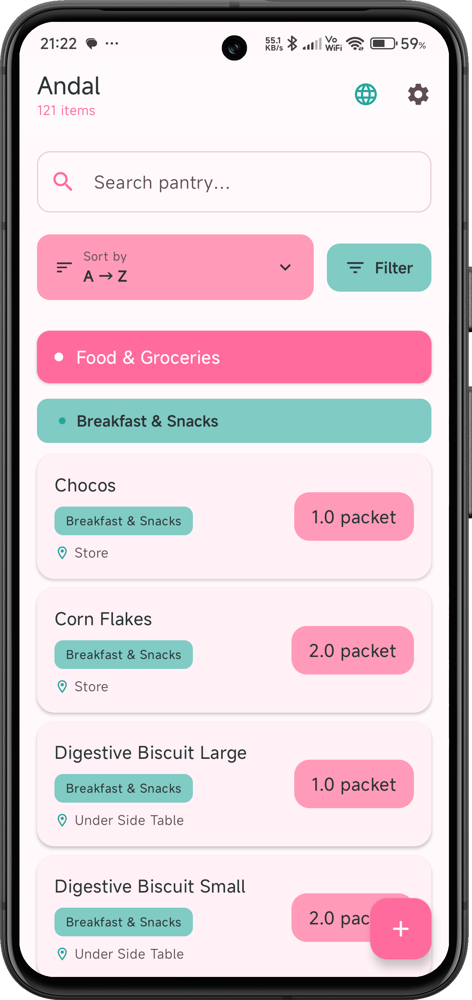
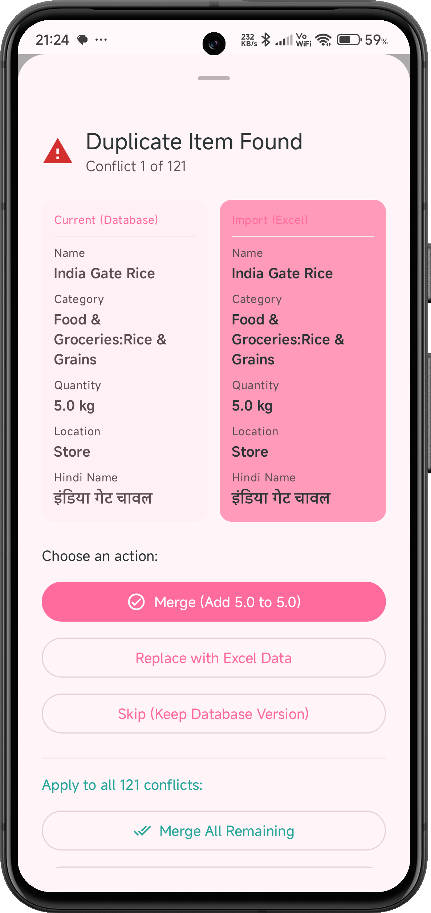
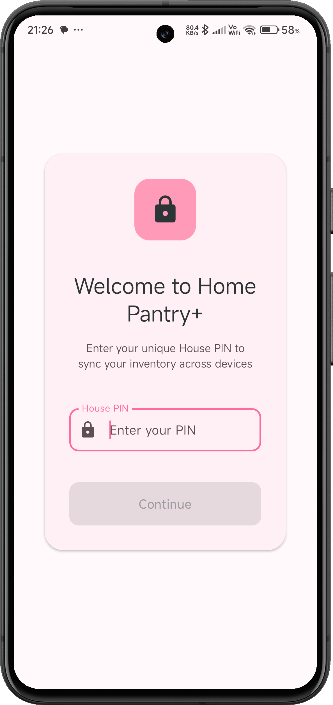

# Home Pantry+ 🏠🍎

> Smart inventory management for the modern kitchen.

A powerful Android application designed specifically for Indian households to effortlessly manage
grocery inventory, track pantry items, and organize shopping needs. Built with modern Android
development best practices using Jetpack Compose and Firebase.

[](https://kotlinlang.org)
[](https://developer.android.com/jetpack/compose)
[](https://firebase.google.com/)
[](LICENSE)

---

## 📱 Screenshots

| Home Screen                          | Conflict Resolution                              | Authentication Screen                |
|--------------------------------------|--------------------------------------------------|--------------------------------------|
|  |  |  |

---

## ✨ Features Deep Dive

### 🔄 Real-Time Synchronization

Powered by **Firebase Firestore** with `addSnapshotListener`, Home Pantry+ delivers instant updates
across all your devices. Add an item on your phone, and see it appear immediately on your tablet -
no refresh needed.

### 📴 Offline-First Architecture

Your kitchen doesn't stop when the internet does. Home Pantry+ provides full functionality offline,
with automatic background synchronization when connectivity returns. All operations are queued and
executed seamlessly.

### 📊 Smart Excel Import with Conflict Resolution

Import hundreds of items in seconds using `.xlsx` files parsed with **Apache POI**. The standout
feature is our unique **Conflict Resolution UI** - inspired by Windows file copy dialogs:

- **Intelligent Detection**: Automatically identifies duplicate items during import
- **Manual Control**: Review each conflict with side-by-side comparison
- **Flexible Options**: Choose to Merge quantities, Replace existing items, or Skip duplicates
- **Final Report**: Complete summary of imported, updated, and skipped items

### 🎨 Berry Fresh UI Design

A custom **Material 3** theme featuring Rose Pink and Teal Fresh colors creates a delightful user
experience:

- **Sticky Headers**: Navigate nested categories (Main Category → Sub-category) effortlessly
- **Smooth Animations**: Polished transitions throughout the app
- **Dark Mode Support**: Easy on the eyes, day or night
- **Intuitive Layout**: Information-dense yet clean interface

### 🔍 Powerful Search & Sort

Find what you need, when you need it:

- **Deep Search**: Searches across item names, Hindi names, and notes
- **Multi-Sort Options**:
    - Alphabetical (A-Z)
    - Quantity (Low to High / High to Low)
    - Date Added (Newest First using strict `added_on` timestamps)
- **Real-time Filtering**: Results update as you type

### 🌐 Bilingual Support

Built for Indian households with native support for:

- English item names
- Hindi item names (हिंदी नाम)
- Seamless switching between languages

---

## 🏗️ Technical Architecture

### The Firebase Migration

Home Pantry+ recently underwent a complete architectural migration from Supabase to **Firebase
Firestore**, resulting in:

- **Better Real-time Capabilities**: Native snapshot listeners for instant updates
- **Improved Offline Support**: Firestore's built-in offline persistence
- **Simplified Authentication**: Seamless integration with Firebase Auth
- **Enhanced Scalability**: NoSQL flexibility for growing data needs

### MVVM Architecture Pattern

```
┌─────────────────┐
│   UI Layer      │  ← Jetpack Compose
│  (Composables)  │
└────────┬────────┘
         │
┌────────▼────────┐
│   ViewModel     │  ← State Management
│    Layer        │     LiveData/StateFlow
└────────┬────────┘
         │
┌────────▼────────┐
│  Repository     │  ← Data Abstraction
│    Layer        │
└────────┬────────┘
         │
┌────────▼────────┐
│  Data Sources   │  ← Firebase Firestore
│                 │     Apache POI
└─────────────────┘
```

**Key Components:**

- **UI Layer**: Composable functions using Material 3 components
- **ViewModel**: Manages UI state and business logic using Kotlin Flows
- **Repository**: Single source of truth, handles data operations
- **Data Sources**: Firebase Firestore for cloud storage, Apache POI for Excel parsing
- **Dependency Injection**: Hilt for clean dependency management

---

## 🛠️ Tech Stack

| Category                 | Technology                   |
|--------------------------|------------------------------|
| **Language**             | Kotlin                       |
| **UI Toolkit**           | Jetpack Compose (Material 3) |
| **Architecture**         | MVVM + Repository Pattern    |
| **Dependency Injection** | Hilt                         |
| **Backend**              | Firebase Firestore (NoSQL)   |
| **Authentication**       | Firebase Auth                |
| **Excel Parsing**        | Apache POI                   |
| **Asynchronous**         | Kotlin Coroutines & Flows    |
| **Local Storage**        | Room Database (cache)        |
| **Build System**         | Gradle (Kotlin DSL)          |

---

## 🚀 Getting Started

### Prerequisites

- Android Studio Hedgehog (2023.1.1) or later
- JDK 17 or higher
- Android SDK with minimum API 24 (Android 7.0)
- A Firebase project (free tier is sufficient)

### Step-by-Step Setup

#### 1. Clone the Repository

```bash
git clone https://github.com/yourusername/home-pantry-plus.git
cd home-pantry-plus
```

#### 2. Firebase Configuration

**Critical**: The app requires `google-services.json` for Firebase integration.

1. Go to the [Firebase Console](https://console.firebase.google.com/)
2. Create a new project (or use existing)
3. Add an Android app with package name: `com.yourpackage.homepantry`
4. Download the `google-services.json` file
5. Place it in the `app/` directory:

```
home-pantry-plus/
├── app/
│   ├── google-services.json  ← Place here
│   ├── build.gradle.kts
│   └── src/
```

6. Enable **Firestore Database** and **Firebase Authentication** in the Firebase Console

#### 3. Build the Project

```bash
./gradlew build
```

#### 4. Run on Device/Emulator

```bash
./gradlew installDebug
```

Or use Android Studio's run button (▶️).

### Configuration Notes

- **Firebase Rules**: Set up appropriate Firestore security rules for production
- **API Keys**: Never commit `google-services.json` to public repositories
- **Signing Config**: Configure your own signing keys for release builds

---

## 🎯 The Conflict Resolution Logic

One of Home Pantry+'s most innovative features is the **Excel Import with Conflict Resolution**.
Here's how it works under the hood:

### The Import Pipeline

```
┌──────────────────┐
│  1. File Select  │  User picks .xlsx file
└────────┬─────────┘
         │
┌────────▼─────────┐
│  2. Parse Excel  │  Apache POI reads workbook
│                  │  Validates columns (Name, Quantity, etc.)
└────────┬─────────┘
         │
┌────────▼─────────┐
│ 3. Detect Dupes  │  Compare with existing Firestore items
│                  │  Match by: Name (case-insensitive)
└────────┬─────────┘
         │
┌────────▼─────────┐
│ 4. User Decision │  Show Conflict Dialog
│                  │  Options: Merge / Replace / Skip
└────────┬─────────┘
         │
┌────────▼─────────┐
│ 5. Batch Write   │  Execute Firestore operations
│                  │  Update/Add items atomically
└────────┬─────────┘
         │
┌────────▼─────────┐
│ 6. Final Report  │  ✅ X items imported
│                  │  🔄 Y items updated
│                  │  ⏭️ Z items skipped
└──────────────────┘
```

### Conflict Resolution Options

When a duplicate is detected, users see a dialog showing:

**Existing Item** (left) | **New Item** (right)

- **Merge**: Add quantities together, keep existing metadata
- **Replace**: Overwrite completely with new data
- **Skip**: Ignore the new item, keep existing

This granular control ensures data integrity while maintaining flexibility for different use cases (
e.g., restocking vs. inventory reset).

### Technical Highlights

- **Batch Operations**: All Firestore writes are batched for atomic transactions
- **Progress Tracking**: Real-time progress bar during large imports
- **Error Handling**: Graceful fallback with detailed error messages
- **Memory Efficient**: Streams large Excel files without loading entire dataset

---

## 🗺️ Future Roadmap

Home Pantry+ is actively evolving. Upcoming features include:

### 🔜 Short-term Goals

- **Barcode Scanner Integration**: Add items by scanning product barcodes
- **Recipe Management**: Link pantry items to recipes with auto-deduction
- **Expiry Date Tracking**: Notifications for items nearing expiration
- **Shopping List Mode**: Convert low-stock items to shopping lists
- **Multi-user Households**: Share inventory with family members

### 🔭 Long-term Vision

- **Smart Suggestions**: AI-powered recommendations based on usage patterns
- **Price Tracking**: Monitor price trends across shopping sessions
- **Nutritional Info**: Display nutrition data for tracked items
- **Voice Commands**: "Add 2 liters of milk" hands-free operation
- **Meal Planning**: Weekly meal planner with pantry integration
- **Export Reports**: Generate consumption reports in PDF/CSV
- **Widget Support**: Quick-add widget for home screen
- **Wear OS Companion**: Check inventory from your smartwatch

### 🛡️ Quality Improvements

- **Unit Testing**: Comprehensive test coverage with JUnit and Mockito
- **UI Testing**: Compose UI tests for critical user flows
- **Performance Optimization**: Lazy loading and pagination for large inventories
- **Accessibility**: Full TalkBack support and screen reader compatibility
- **Localization**: Support for additional Indian languages (Tamil, Bengali, etc.)

---

## 🤝 Contributing

Contributions are welcome! Please feel free to submit a Pull Request. For major changes, please open
an issue first to discuss what you would like to change.

### Development Guidelines

1. Fork the repository
2. Create your feature branch (`git checkout -b feature/AmazingFeature`)
3. Follow Kotlin coding conventions and Material Design guidelines
4. Write clear commit messages
5. Push to the branch (`git push origin feature/AmazingFeature`)
6. Open a Pull Request

---

## 📄 License

This project is licensed under the MIT License - see the [LICENSE](LICENSE) file for details.

---

## 🙏 Acknowledgments

- **Firebase Team** for the robust backend infrastructure
- **Apache POI Contributors** for Excel parsing capabilities
- **Jetpack Compose Team** for the modern UI toolkit
- **Material Design** for design inspiration

---

## 📧 Contact

For questions, suggestions, or feedback, please open an issue on GitHub or reach out via:

- **GitHub Issues**: [Project Issues](https://github.com/yourusername/home-pantry-plus/issues)
- **Email**: your.email@example.com

---

<div align="center">

**Made with ❤️ for Indian households**

*Keeping your kitchen organized, one item at a time.*

</div>